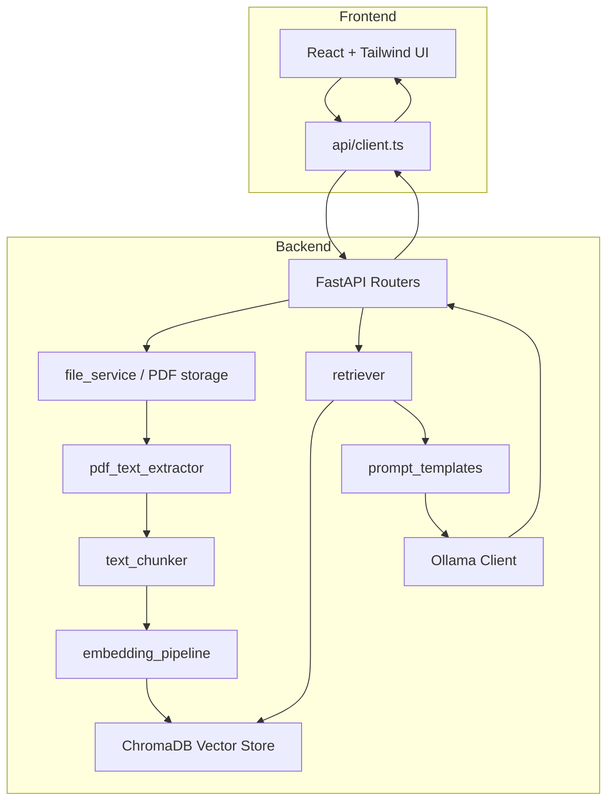

<div align="center">

# 🧠 Synapse AI

**Reads. Remembers. Responds.**

A modern **Retrieval-Augmented Generation (RAG)** application that lets you upload PDF documents and chat with them using a local AI model.

[](https://react.dev)
[](https://www.typescriptlang.org)
[](https://vitejs.dev)
[](https://tailwindcss.com)
[](https://fastapi.tiangolo.com)
[](https://www.python.org)
[](https://www.trychroma.com)
[](https://ollama.com)
[](https://opensource.org/licenses/MIT)

</div>

---

## 📖 About the Project

Synapse AI is a full-stack **Retrieval-Augmented Generation (RAG)** application that combines a futuristic React frontend with a FastAPI backend to deliver an interactive document-chat experience.

Instead of relying solely on the LLM's pre-trained knowledge, Synapse AI **retrieves relevant information from your uploaded PDFs** before generating a response. The answer is *grounded* in your document — not hallucinated from the model's training data.

> 🎯 **Tagline:** _Reads. Remembers. Responds._

The project demonstrates a complete, production-style RAG pipeline:


---

## 🚨 Problem Statement

Large documents are hard to query, and traditional LLMs don't know your private data. Synapse AI solves this.

| Problem | How Synapse AI Solves It |
| --- | --- |
| 📄 **Large PDFs are difficult to search manually** | Full-text extraction + semantic search finds the *meaning*, not just keywords. |
| ⏱️ **Users waste hours reading entire documents** | Ask a question and get an instant, document-aware answer. |
| 💭 **Generic AI models hallucinate** | The LLM answers **only from retrieved context** — it is instructed to say *"I don't know"* when the answer isn't in the document. |
| 🔒 **Private documents stay private** | Everything runs locally with Ollama — documents never leave your machine. |
| 🏢 **Businesses need secure document chat** | Grounded, source-anchored answers on your own files, fully self-hosted. |

### Why RAG?

A traditional LLM has a fixed knowledge cutoff and no access to your documents. **RAG** bridges that gap by retrieving the most relevant text chunks from a vector database at query time and feeding them to the LLM as context — so answers are **accurate, up-to-date, and grounded** in your actual content.

---

## ✨ Features

### 📤 Upload PDF Documents
Drag-and-drop or browse to upload PDF files. A smart validation layer verifies the file extension, the `%PDF-` signature, and readability with `PyPDF2` before accepting the document.

### 🔎 Automatic Text Extraction
The backend extracts raw text from every page of the PDF using `PyPDF2`, cleaning up whitespace and concatenating pages into one searchable body of text.

### 🧩 Intelligent Text Chunking
Extracted text is split into overlapping chunks (default `chunk_size=1000`, `chunk_overlap=200`) using LangChain's `RecursiveCharacterTextSplitter`, with a robust character-based fallback splitter.

### 🧬 Embedding Generation
Every chunk is converted into a dense vector using `sentence-transformers/all-MiniLM-L6-v2` through `HuggingFaceEmbeddings` — capturing semantic meaning, not just keywords.

### 🗄️ Vector Database Storage
Embeddings are persisted in a local **ChromaDB** vector store (`synapse_ai_docs` collection), enabling fast and persistent semantic retrieval across restarts.

### 🎯 Semantic Similarity Search
When you ask a question, the query is embedded and matched against stored chunks using cosine similarity (`top_k=5` by default), returning the most relevant passages.

### 🤖 Retrieval-Augmented Generation
Relevant chunks are assembled into a grounding prompt and sent to a local **Ollama** model, which answers using **only** the provided context — dramatically reducing hallucination.

### 💬 AI-Powered Document Chat
A polished chat panel streams intelligent, document-grounded responses. If no document has been uploaded yet, the assistant politely prompts you to upload a PDF first.

### 🧠 Memory Bank Panel
Every uploaded document appears in the futuristic **Memory Bank** sidebar with its PDF icon, file size, upload time, and a glowing **"Indexed"** status chip.

### 🎨 Beautiful Futuristic UI
- ✨ **Glassmorphism** design with frosted-glass cards and backdrop blur
- 🌈 **Cyberpunk glow** accents (cyan / purple / pink)
- 🎞️ **Framer Motion** animations — staggered list entries, hover lifts, typing indicators
- 📱 **Responsive layout** that adapts from mobile to widescreen
- 🧾 **Toast notifications** for upload success/failure
- 💾 **Boot screen** and animated background orbs for a sci-fi feel

---

## 🔬 How the RAG Pipeline Works

```
PDF Upload
   ↓
Text Extraction
   ↓
Text Cleaning
   ↓
Chunking
   ↓
Embedding Generation
   ↓
Vector Storage
   ↓
User Query
   ↓
Query Embedding
   ↓
Similarity Search
   ↓
Relevant Context Retrieval
   ↓
Prompt Construction
   ↓
LLM Response Generation
   ↓
Response Returned to User
```

1. **PDF Upload** — The file is validated, stored on disk, and assigned a unique document ID.
2. **Text Extraction** — `PyPDF2` reads every page and extracts the raw text.
3. **Text Cleaning** — Whitespace is trimmed and page texts are joined into a clean corpus.
4. **Chunking** — The corpus is split into overlapping 1,000-character chunks (200-character overlap) so context isn't lost at boundaries.
5. **Embedding Generation** — Each chunk is embedded with `all-MiniLM-L6-v2` into a 384-dimensional vector.
6. **Vector Storage** — Chunk vectors + metadata are persisted in a local ChromaDB collection.
7. **User Query** — The user asks a question in the chat panel.
8. **Query Embedding** — The question is embedded with the *same* model to ensure comparable vector space.
9. **Similarity Search** — ChromaDB returns the top-k most semantically similar chunks.
10. **Relevant Context Retrieval** — The top chunks are formatted with metadata into a context block.
11. **Prompt Construction** — A grounding prompt instructs the LLM to answer *only* from the context.
12. **LLM Response Generation** — Ollama generates the grounded answer.
13. **Response Returned** — The answer (plus retrieved chunks for debugging) is returned to the UI.

---

## 🛠️ Tech Stack

### Frontend

| Technology | Purpose |
| --- | --- |
| [React 18](https://react.dev) | UI component library |
| [TypeScript](https://www.typescriptlang.org) | Type-safe JavaScript |
| [Tailwind CSS 3](https://tailwindcss.com) | Utility-first styling + custom cyber theme |
| [Vite 5](https://vitejs.dev) | Fast dev server & build tool |
| [Framer Motion](https://www.framer.com/motion/) | Buttery-smooth UI animations |
| [Lucide Icons](https://lucide.dev) | Clean, consistent icon set |

### Backend

| Technology | Purpose |
| --- | --- |
| [FastAPI](https://fastapi.tiangolo.com) | High-performance async API framework |
| [Python 3.10+](https://www.python.org) | Core language |
| [Uvicorn](https://www.uvicorn.org) | ASGI server |
| [PyPDF2](https://pypi.org/project/PyPDF2/) | PDF text extraction |
| [LangChain](https://www.langchain.com) | Text splitting & vector store wrappers |
| [Sentence Transformers](https://sbert.net) | `all-MiniLM-L6-v2` embedding model |
| [ChromaDB](https://www.trychroma.com) | Persistent vector database |
| [Ollama](https://ollama.com) | Local LLM inference (e.g. `llama3`) |
| [Requests](https://requests.readthedocs.io) | HTTP client to Ollama |

---

## 🏗️ Project Architecture



**Data flow at a glance:**

- **Ingestion path:** `POST /api/upload-rag` → store → extract → chunk → embed → ChromaDB
- **Query path:** `POST /api/rag-chat` → retrieve top-k → build prompt → Ollama → reply

---

## 📂 Folder Structure

```text
synapse-ai/
├── frontend/                          # React + Vite + Tailwind app
│   └── src/
│       ├── components/
│       │   ├── AppShell.tsx           # Layout shell (if present)
│       │   ├── BootScreen.tsx         # Futuristic boot animation
│       │   ├── ChatPanel.tsx          # Chat UI + input + scroll handling
│       │   ├── ChatEmptyState.tsx     # Empty chat placeholder
│       │   ├── GlassMessageBubble.tsx # Glass-styled message bubbles
│       │   ├── Sidebar.tsx            # "Memory Bank" document list
│       │   ├── Toast.tsx              # Toast notification system
│       │   ├── TypingIndicator.tsx    # Animated typing dots
│       │   └── UploadArea.tsx         # Drag-and-drop PDF upload
│       ├── api/
│       │   └── client.ts              # All backend API calls
│       ├── App.tsx                    # Root component & state
│       ├── styles.css                 # Global styles, glassmorphism, keyframes
│       └── main.tsx                   # React entry point
│
├── backend/                           # FastAPI RAG backend
│   └── app/
│       ├── main.py                    # App factory, CORS, router mounting
│       ├── core/
│       │   ├── config.py              # Settings (env-driven)
│       │   └── cors.py                # CORS middleware helper
│       ├── api/routes/
│       │   ├── health.py              # GET /api/health
│       │   ├── files.py               # /upload, /upload-rag, /extract-text
│       │   ├── chat.py                # POST /api/chat
│       │   ├── embeddings.py          # POST /api/embed-and-store
│       │   ├── retrieval.py           # POST /api/retrieve
│       │   ├── rag.py                 # POST /api/rag-chat
│       │   └── *_models.py            # Pydantic request/response models
│       └── services/
│           ├── file_service.py        # PDF validation & disk storage
│           ├── pdf_text_extractor.py  # PyPDF2 text extraction
│           ├── text_chunker.py        # Chunking logic
│           ├── embedding_pipeline.py  # Chunk → embed → store orchestration
│           ├── vector_store.py        # ChromaDB wrapper
│           ├── retriever.py           # Similarity search
│           ├── prompt_templates.py    # Grounding prompt template
│           ├── response_generation.py # Context builder + grounded replies
│           └── ollama_client.py       # Ollama /api/generate client
│
├── README.md                          # You are here 📖
└── .gitignore
```

**Key responsibilities:**

- **`frontend/src/components/`** — Presentational + stateful UI components with glassmorphism styling.
- **`frontend/src/api/client.ts`** — Thin typed wrapper over the FastAPI endpoints.
- **`backend/app/api/routes/`** — HTTP layer: request parsing, validation, orchestration.
- **`backend/app/services/`** — Business logic: extraction, chunking, embeddings, retrieval, generation.
- **`backend/app/core/`** — Shared configuration (settings, CORS).

---

## 🚀 Installation Guide

### Prerequisites

- **Node.js 18+** and npm
- **Python 3.10+**
- **Ollama** ([download](https://ollama.com/download))

### 1️⃣ Clone the Repository

```bash
git clone https://github.com/your-username/synapse-ai.git
cd synapse-ai
```

### 2️⃣ Backend Setup

```bash
cd backend

# Create a virtual environment
python -m venv .venv

# Activate it
# Windows (PowerShell)
.venv\Scripts\Activate.ps1
# Windows (CMD)
.venv\Scripts\activate.bat
# macOS / Linux
source .venv/bin/activate

# Install dependencies
pip install -r requirements.txt

# Run the FastAPI server
uvicorn app.main:app --reload --port 8000
```

> ✅ Backend will be live at **http://localhost:8000** — interactive API docs at **http://localhost:8000/docs**

### 3️⃣ Frontend Setup

```bash
cd ../frontend

# Install dependencies
npm install

# Start the dev server
npm run dev
```

> ✅ Frontend will be live at **http://localhost:5173**

### 4️⃣ Install Ollama

```bash
# Download & install Ollama (or use the official installer)
# https://ollama.com/download

# Pull the default chat model used by the RAG endpoints
ollama pull llama3

# (Optional) Alternative model referenced in some services
ollama pull qwen2.5-coder:1.5b

# Start the Ollama server
ollama serve
```

> ✅ Ollama runs by default at **http://localhost:11434**

### 5️⃣ Open the App

Browse to **http://localhost:5173**, upload a PDF, and start chatting with your document! 🎉

---

## 🔧 Environment Variables

All variables are optional — sensible defaults are baked in.

| Variable | Default | Description |
| --- | --- | --- |
| `VITE_BACKEND_URL` | `http://127.0.0.1:8000` | Base URL of the FastAPI backend (frontend). |
| `SYNAPSE_UPLOAD_DIR` | `./uploads` | Directory where uploaded PDFs are stored (backend). |
| `SYNAPSE_CHROMA_DIR` | `./chroma_db` | Directory where the ChromaDB vector store persists (backend). |
| `OLLAMA_HOST` | `http://localhost:11434` | Base URL of the Ollama inference server (backend). |

> 💡 To set a variable, create a `.env` file in the `frontend/` (for `VITE_*`) or `backend/` (for `SYNAPSE_*` / `OLLAMA_*`) directory — or export it in your shell.

---

## 📡 API Endpoints

| Method | Endpoint | Description |
| --- | --- | --- |
| `GET` | `/api/health` | Health check — returns `{"status": "ok"}`. |
| `POST` | `/api/upload` | Upload & store a PDF **only** (no RAG processing). |
| `POST` | `/api/upload-rag` | **Full ingestion**: upload → extract → chunk → embed → store in ChromaDB. |
| `POST` | `/api/extract-text` | Upload a PDF and return its extracted raw text + chunks. |
| `POST` | `/api/chat` | Grounded chat using retrieved Chroma context via Ollama. |
| `POST` | `/api/embed-and-store` | Embed and store chunks for an already-uploaded `document_id`. |
| `POST` | `/api/retrieve` | Semantic similarity search — returns top-k relevant chunks. |
| `POST` | `/api/rag-chat` | **End-to-end RAG chat**: retrieve context + generate grounded answer. |

### Example — Upload & Index a PDF

```bash
curl -X POST http://localhost:8000/api/upload-rag \
  -F "file=@/path/to/document.pdf"
```

```json
{
  "document": {
    "id": "8f2a1c9e-...",
    "name": "document.pdf",
    "size": 245760,
    "uploadedAt": 1740000000000
  },
  "stored": 12,
  "chunk_count": 12,
  "chunk_size": 1000,
  "chunk_overlap": 200
}
```

### Example — RAG Chat

```bash
curl -X POST http://localhost:8000/api/rag-chat \
  -H "Content-Type: application/json" \
  -d '{
    "message": "What is this document about?",
    "document_id": "8f2a1c9e-...",
    "top_k": 5
  }'
```

```json
{
  "reply": "This document explains the quarterly financial results...",
  "retrieved_chunks": [ ],
  "document_id": "8f2a1c9e-..."
}
```

---

## 📸 Screenshots

### Home Page

(Add screenshot here)

### Upload

(Add screenshot here)

### Chat

(Add screenshot here)

### Memory Bank

(Add screenshot here)

---

## 🔮 Future Improvements

- 🖼️ **OCR support** — Extract text from scanned/image-based PDFs.
- 👁️ **Image understanding** — Let the model describe and reason about figures & charts.
- ⚡ **Streaming responses** — Token-by-token streaming with `stream=True`.
- 🔐 **Authentication** — User accounts, session management, API keys.
- ☁️ **Cloud deployment** — Dockerize and deploy frontend + backend + Chroma.
- 👥 **Multi-user workspace** — Isolate documents and memory per user/team.
- 💬 **Conversation history** — Persistent multi-turn context in the chat.
- 📚 **Citation support** — Show the exact source chunk + page for every answer.
- 🔀 **Hybrid search** — Combine semantic + keyword (BM25) retrieval.
- 📝 **Document summarization** — Auto-generate abstracts for uploaded PDFs.

---

## ⚖️ Why RAG instead of Traditional LLM?

| Aspect | Traditional LLM | RAG (Synapse AI) |
| --- | --- | --- |
| 🧠 Knowledge source | Static training data (cutoff date) | Your uploaded documents, always current |
| 🎯 Answer accuracy | Hallucination-prone | Grounded in retrieved context |
| 🔒 Privacy | Data may leave your infrastructure | Fully local with Ollama |
| 🔎 Specific documents | Cannot see private files | Searches the actual document |
| 📏 Context limits | Fixed context window | Retrieves only relevant chunks |
| 🏢 Enterprise fit | Generic answers | Document-aware, source-anchored answers |
| 💰 Cost | Token-heavy on large docs | Pay-as-you-need, selective retrieval |

---

## 🎓 Learning Outcomes

By studying this project you'll learn:

- 🐍 **FastAPI** — Async routing, Pydantic models, file uploads, CORS, app factories.
- ⚛️ **React** — Component architecture, hooks, state management, controlled forms.
- 🧪 **TypeScript** — Strong typing, interfaces, type-safe API clients.
- 🧬 **Embeddings** — How text becomes dense vectors (`all-MiniLM-L6-v2`).
- 🗄️ **Vector Databases** — Persistent storage and similarity search with ChromaDB.
- 🎯 **Semantic Search** — Cosine similarity and `top_k` retrieval.
- ✍️ **Prompt Engineering** — Designing grounding prompts that prevent hallucination.
- 🤖 **LLM Integration** — Calling Ollama's `/api/generate` locally.
- 🔗 **RAG** — The full retrieval-augmented generation pipeline.
- 🏛️ **System Design** — Clean separation of routes, services, and models.

---

## 🤝 Contributing

Contributions are welcome! 🎉

1. **Fork** the repository.
2. Create a feature branch:

   ```bash
   git checkout -b feat/your-awesome-feature
   ```

3. **Commit** your changes with clear messages:

   ```bash
   git commit -m "feat: add OCR support for scanned PDFs"
   ```

4. **Push** to your branch:

   ```bash
   git push origin feat/your-awesome-feature
   ```

5. Open a **Pull Request** with a detailed description of your changes.

### Guidelines

- Follow existing code style and folder conventions.
- Add tests where feasible.
- Keep the RAG pipeline modular — new retrievers/embedders should slot into `services/`.
- Update the README if you change public APIs or environment variables.

---

## 📄 License

Distributed under the **MIT License**.

```text
MIT License

Copyright (c) 2025 Synapse AI

Permission is hereby granted, free of charge, to any person obtaining a copy
of this software and associated documentation files (the "Software"), to deal
in the Software without restriction, including without limitation the rights
to use, copy, modify, merge, publish, distribute, sublicense, and/or sell
copies of the Software, and to permit persons to whom the Software is
furnished to do so, subject to the following conditions:

The above copyright notice and this permission notice shall be included in all
copies or substantial portions of the Software.

THE SOFTWARE IS PROVIDED "AS IS", WITHOUT WARRANTY OF ANY KIND, EXPRESS OR
IMPLIED, INCLUDING BUT NOT LIMITED TO THE WARRANTIES OF MERCHANTABILITY,
FITNESS FOR A PARTICULAR PURPOSE AND NONINFRINGEMENT. IN NO EVENT SHALL THE
AUTHORS OR COPYRIGHT HOLDERS BE LIABLE FOR ANY CLAIM, DAMAGES OR OTHER
LIABILITY, WHETHER IN AN ACTION OF CONTRACT, TORT OR OTHERWISE, ARISING FROM,
OUT OF OR IN CONNECTION WITH THE SOFTWARE OR THE USE OR OTHER DEALINGS IN THE
SOFTWARE.
```

---

## 👤 Author

**Your Name**

- GitHub: [Chavva-Harshita]((https://github.com/Chavva-Harshita))
- LinkedIn: [Harshita Chavva]((https://www.linkedin.com/in/harshita-chavva-86b417316/))

---

<div align="center">

Made with ❤️ and a lot of ☕ — **Synapse AI** · _Reads. Remembers. Responds._

</div>

